# Feature tour

A walk through the interface, captured against a demo instance with generated
test data (`example.com`, `Acme Ltd`). Nothing here is live data.

## Overview

The landing page: how much mail was reported over the last 30 days, how much
passed DMARC, how much failed, and how many messages are sitting in the
unrouted quarantine, followed by the most recent reports.

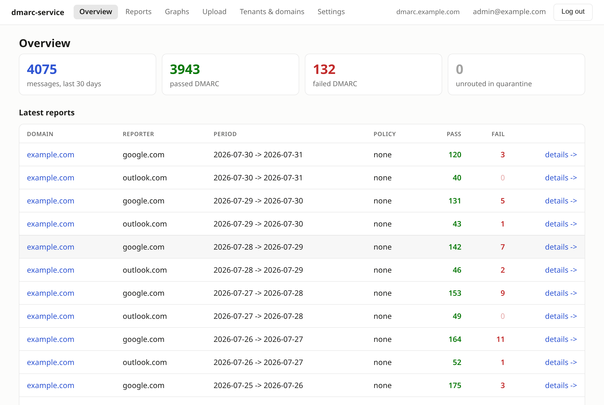

## Reports

Every aggregate report, filterable by tenant, by domain, and by day. The
tenant selector appears once more than one tenant exists, and the domain list
narrows to the tenant you pick.

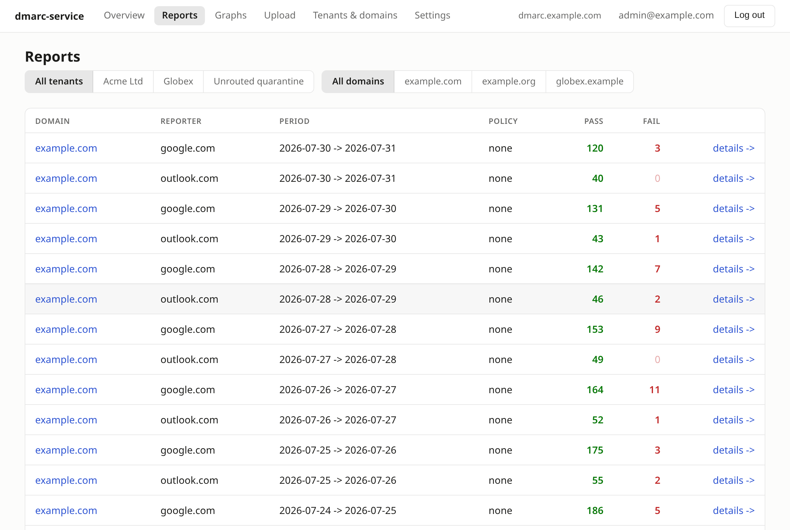

## Report detail

The useful screen. Each row is a sending source: the IP with the organisation
that owns the network (resolved through reverse DNS and RDAP, so you see
"Twilio SendGrid" rather than a bare address), whether that source is in your
own SPF, how many messages it sent, the DMARC verdict, and the domain the mail
actually **authenticated as**.

Two columns do the real work. **In your SPF** expands your published record
(every include, a, mx and ip term, bounded the way RFC 7208 bounds it) and
labels the source authorized, authenticated-but-not-in-SPF, or unknown. It also
reveals SPF includes that never send, which are authorisations you can withdraw.
**Authenticated as** separates your own misconfigured tooling (which
authenticates as something of yours) from forwarding and from outright spoofing
(which authenticates as a stranger's domain, or not at all).

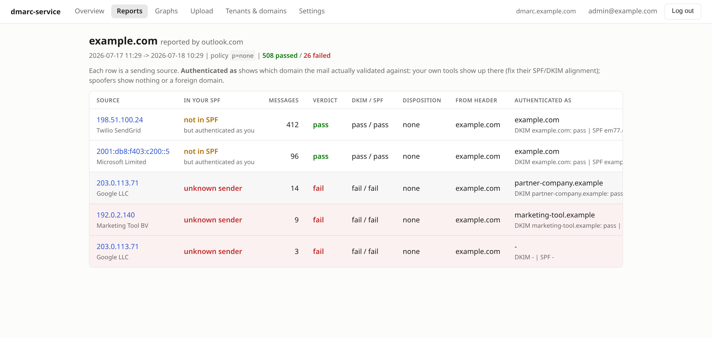

## Graphs

Daily pass/fail volume over 30 or 90 days, per tenant or per domain. Click any
bar to jump to that day's reports. A day with no report at all is called out:
senders report daily, so a hole means reports were lost rather than that no
mail was sent, and that is worth knowing before tightening a policy. Rendered server-side as SVG, with a table
fallback underneath, and readable without relying on colour alone.

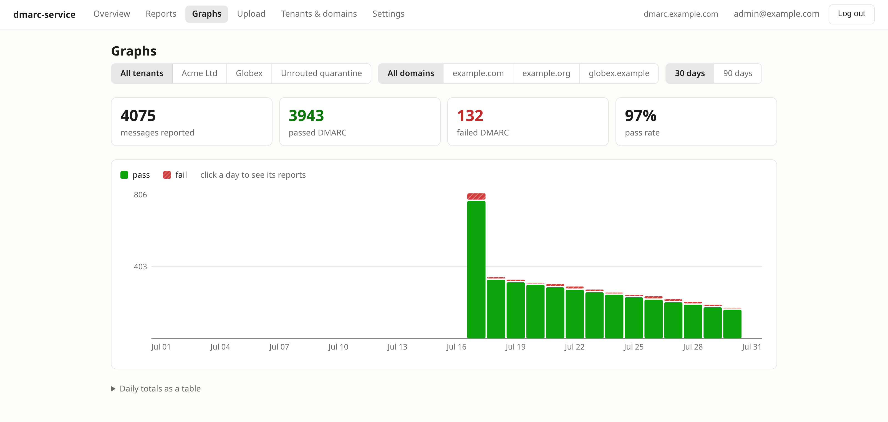

The interface follows the operating system's light or dark theme:

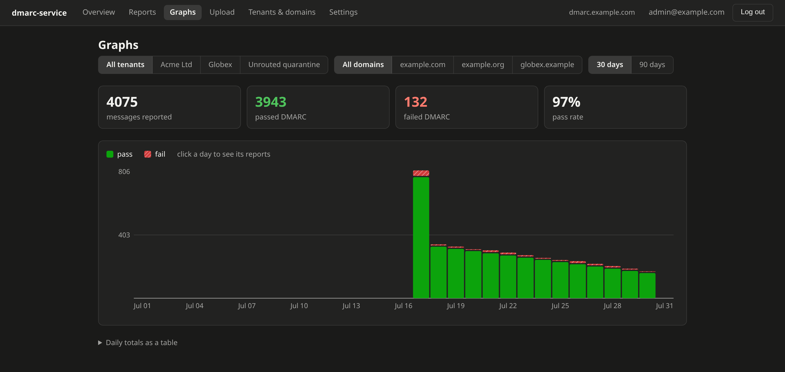

## Tenants and domains

Tenants own domains; domains own report addresses. Each domain shows how many
of its own records are published, and the page also lists the records **you**
owe as the operator: adding a domain whose organizational domain differs from
the report host creates a verification record that only your zone can publish,
and nothing else will tell you that. Mail that no active address claims is kept
in a quarantine rather than bounced, so a typo in a DNS record never means
silently losing reports.

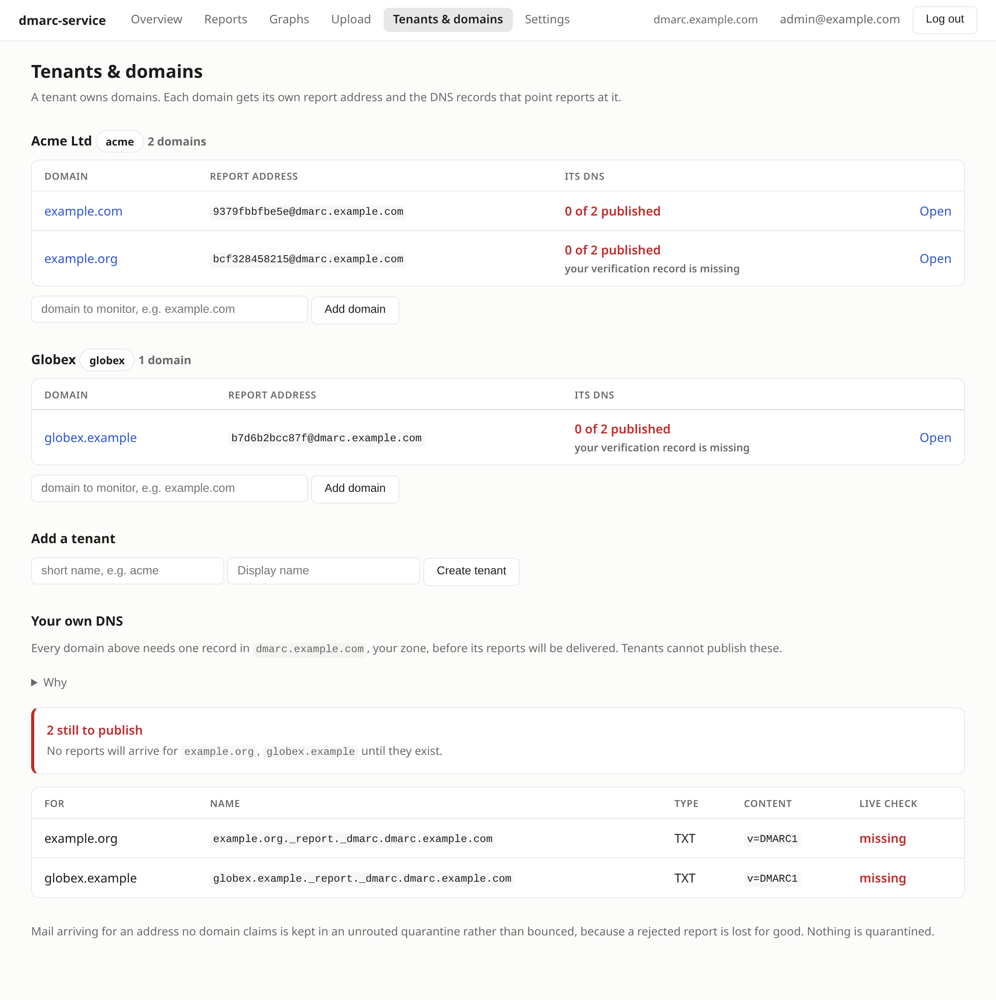

## DNS records, verified live

Per domain, the exact records to publish, including the external destination
verification record that RFC 7489 requires when the report address lives
outside the monitored domain's organizational domain.

Each record is checked against the domain's **authoritative** nameservers, not
a recursive resolver, because a resolver serves stale positive and negative
answers for as long as the record's TTL and would report a freshly published
record as missing for hours. Statuses are published, missing, different record
found, malformed (present but receivers would ignore it), points at an address
you retired (a rotation left half finished, so reports are going to a dead
address), or lookup failed.
Checks are cached, and the re-check button forces a fresh lookup at most once
a minute.

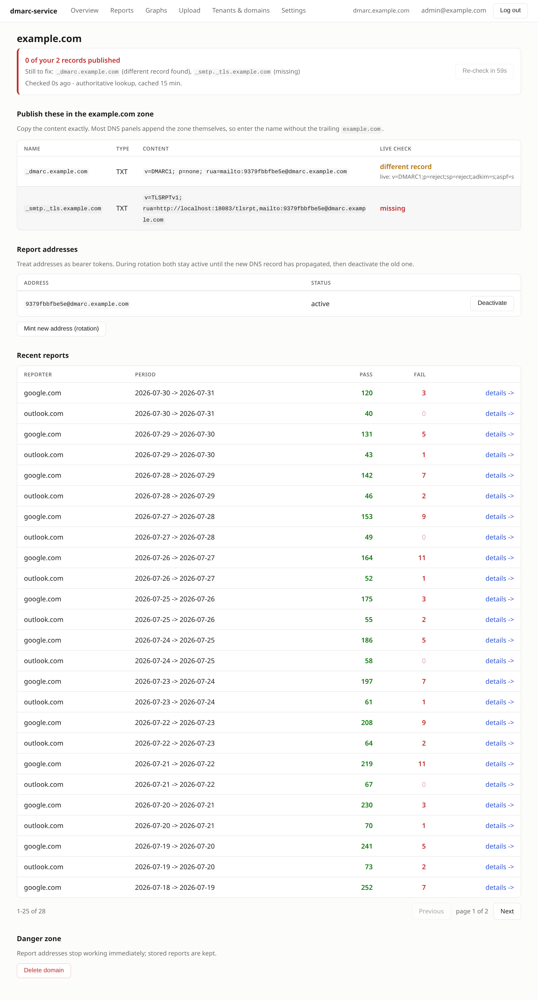

## Manual import

Report files can be imported by hand: `.zip`, `.gz`, raw `.xml` or `.json`, or
whole `.eml` messages, several at once. Useful for historical archives,
reports that landed in somebody's mailbox, or data exported from another
provider. Duplicates are detected, so re-importing an archive is safe.

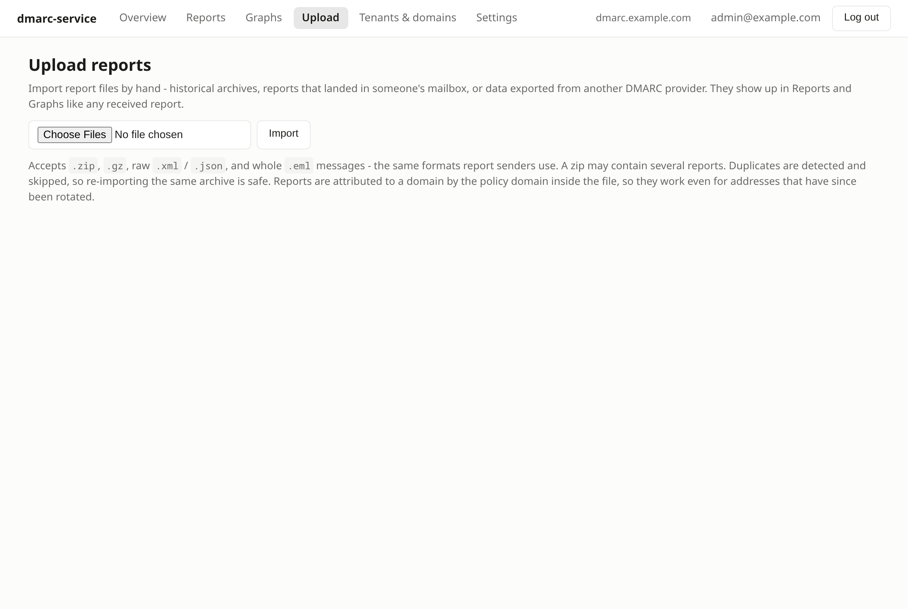

## Accounts, SSO and API tokens

The first account created becomes the administrator, so there is no bootstrap
password in an environment variable. The administrator can then configure an
OIDC provider (Azure AD / Entra, Google Workspace, Keycloak, Okta), promote or
demote other users, and everyone else signs in through SSO. The last
administrator cannot be demoted, and any account, including one provisioned by
SSO, can set a password as a fallback so a broken SSO configuration cannot lock
anyone out; `dmarc-service set-password` and `disable-sso` recover an
installation from the server if it happens anyway.

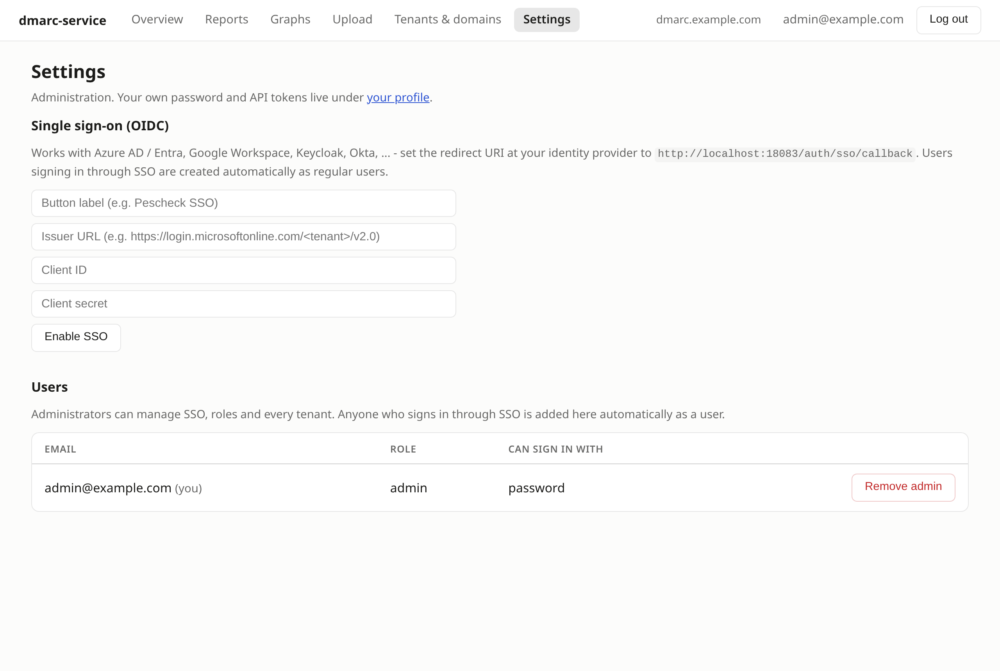

Personal API tokens live under each user's own profile, hashed at rest and shown
exactly once, alongside the password form. Administration stays in Settings.

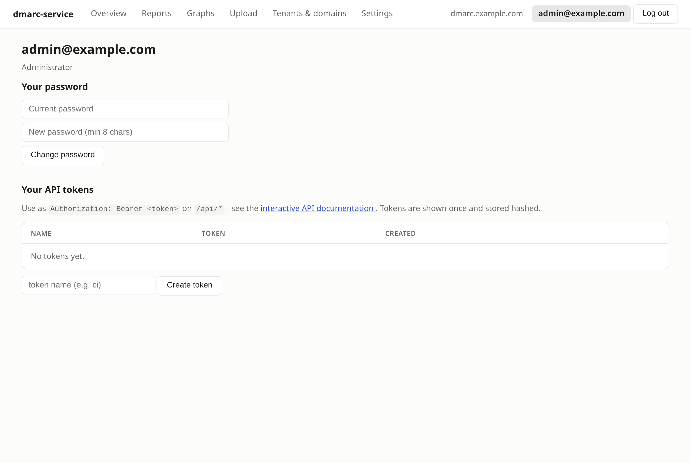

## Intake without port 25

Receiving mail directly is the default: the service mints an address and the
domain owner points `rua` at it, so no credentials exist anywhere. When inbound
port 25 is impossible, or reports have been collecting in a mailbox for months,
`dmarc-service imap` polls that mailbox instead. Because each domain has its own
address, one catch-all mailbox still routes every domain correctly, and
deduplication and quarantine behave exactly as they do for received mail.

## Backups

`dmarc-service backup` dumps the database, uploads it to any S3-compatible
storage and prunes copies past the retention window. One URL carries endpoint,
credentials, bucket and prefix, so Wasabi, AWS, Scaleway, MinIO and Backblaze
all work. Aggregate reports cannot be re-requested from senders, so an unbacked
database is history that cannot be recovered.

## Sign in

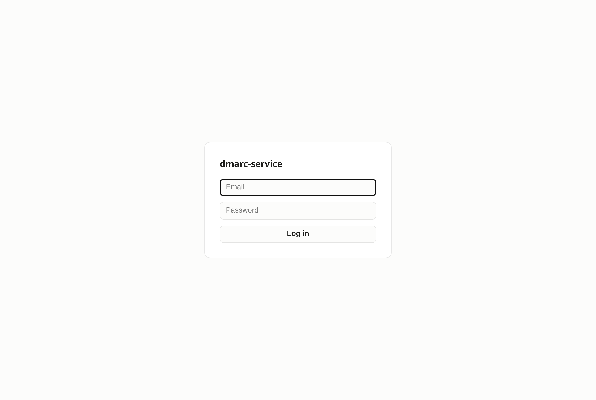
